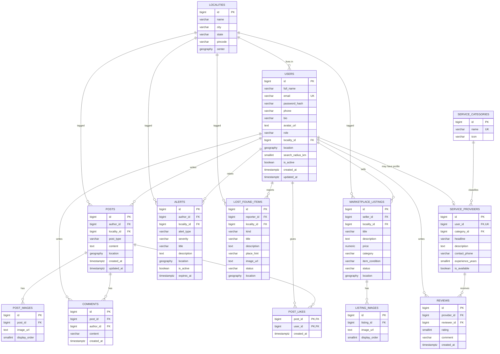

# Padosi - ER Diagram

```mermaid
erDiagram
    LOCALITIES ||--o{ USERS : "lives in"
    LOCALITIES ||--o{ POSTS : "tagged"
    LOCALITIES ||--o{ MARKETPLACE_LISTINGS : "tagged"
    LOCALITIES ||--o{ ALERTS : "tagged"
    LOCALITIES ||--o{ LOST_FOUND_ITEMS : "tagged"

    USERS ||--o{ POSTS : writes
    USERS ||--o{ COMMENTS : writes
    USERS ||--o{ POST_LIKES : gives
    USERS ||--o{ MARKETPLACE_LISTINGS : sells
    USERS ||--o{ ALERTS : raises
    USERS ||--o{ LOST_FOUND_ITEMS : reports
    USERS ||--o| SERVICE_PROVIDERS : "may have profile"
    USERS ||--o{ REVIEWS : writes

    POSTS ||--o{ POST_IMAGES : has
    POSTS ||--o{ COMMENTS : has
    POSTS ||--o{ POST_LIKES : receives

    MARKETPLACE_LISTINGS ||--o{ LISTING_IMAGES : has

    SERVICE_CATEGORIES ||--o{ SERVICE_PROVIDERS : classifies
    SERVICE_PROVIDERS ||--o{ REVIEWS : receives

    LOCALITIES {
        bigint id PK
        varchar name
        varchar city
        varchar state
        varchar pincode
        geography center
    }
    USERS {
        bigint id PK
        varchar full_name
        varchar email UK
        varchar password_hash
        varchar phone
        varchar bio
        text avatar_url
        varchar role
        bigint locality_id FK
        geography location
        smallint search_radius_km
        boolean is_active
        timestamptz created_at
        timestamptz updated_at
    }
    POSTS {
        bigint id PK
        bigint author_id FK
        bigint locality_id FK
        varchar post_type
        text content
        geography location
        timestamptz created_at
        timestamptz updated_at
    }
    POST_IMAGES {
        bigint id PK
        bigint post_id FK
        text image_url
        smallint display_order
    }
    COMMENTS {
        bigint id PK
        bigint post_id FK
        bigint author_id FK
        varchar content
        timestamptz created_at
    }
    POST_LIKES {
        bigint post_id PK, FK
        bigint user_id PK, FK
        timestamptz created_at
    }
    LOST_FOUND_ITEMS {
        bigint id PK
        bigint reporter_id FK
        bigint locality_id FK
        varchar kind
        varchar title
        text description
        varchar place_hint
        text image_url
        varchar status
        geography location
    }
    ALERTS {
        bigint id PK
        bigint author_id FK
        bigint locality_id FK
        varchar alert_type
        varchar severity
        varchar title
        text description
        geography location
        boolean is_active
        timestamptz expires_at
    }
    SERVICE_CATEGORIES {
        bigint id PK
        varchar name UK
        varchar icon
    }
    SERVICE_PROVIDERS {
        bigint id PK
        bigint user_id FK, UK
        bigint category_id FK
        varchar headline
        text description
        varchar contact_phone
        smallint experience_years
        boolean is_available
    }
    REVIEWS {
        bigint id PK
        bigint provider_id FK
        bigint reviewer_id FK
        smallint rating
        varchar comment
        timestamptz created_at
    }
    MARKETPLACE_LISTINGS {
        bigint id PK
        bigint seller_id FK
        bigint locality_id FK
        varchar title
        text description
        numeric price
        varchar category
        varchar item_condition
        varchar status
        geography location
    }
    LISTING_IMAGES {
        bigint id PK
        bigint listing_id FK
        text image_url
        smallint display_order
    }
```
